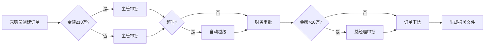
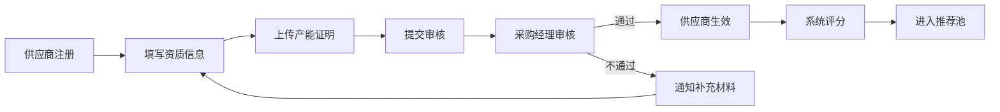

## 1. 产品概述

跨国企业全球采购与供应商协同平台，集成供应商管理、智能询价报价、多级审批采购订单、报关物流、质检退货、财务结算全流程，实现采购全链路数字化管控。

- 解决采购流程分散、供应商管理混乱、审批效率低下、数据孤岛等痛点
- 服务于跨国企业采购部门、供应商、管理层，提升采购效率、降低成本、管控风险
- 核心价值：智能供应商推荐、自动比价、流程自动化、数据驱动决策

## 2. 核心功能

### 2.1 用户角色

| 角色 | 注册方式 | 核心权限 |
|------|----------|----------|
| 供应商 | 自助入驻 + 平台审核 | 查看自己的询价单、报价、订单、质检结果、结算单 |
| 采购员 | 后台创建 | 管理品类、创建询价单、发起议价、创建采购订单 |
| 采购经理 | 后台创建 | 审批订单、查看部门数据、管理采购员 |
| 采购总监 | 后台创建 | 跨区域数据查看、高级审批、战略决策 |
| CEO | 后台创建 | 全局数据管理、大额订单审批、系统配置 |

### 2.2 功能模块

1. **首页数据大屏**：采购金额趋势、到货准时率、质量合格率、采购员效能，多维度筛选与报表导出
2. **供应商管理**：供应商入驻、资质审核、产能配置、智能评分、优质推荐
3. **询价报价系统**：询价单发布、供应商在线报价、自动比价、多轮议价
4. **采购订单**：订单创建、多级审批（主管→财务→总经理）、超时越级、订单跟踪
5. **报关物流**：自动生成报关文件、物流计划、扫码收货、物流跟踪
6. **质检退货**：到货质检、不合格自动退货、供应商通知
7. **财务结算**：合同对账、结算单生成、信用期管控、超期暂停供货

### 2.3 页面详情

| 页面名称 | 模块名称 | 功能描述 |
|----------|----------|----------|
| 登录页 | 身份认证 | 角色选择登录、权限验证、Token管理 |
| 首页大屏 | 数据概览 | 核心KPI卡片、趋势图表、筛选面板、报表导出 |
| 供应商列表 | 供应商管理 | 供应商档案、资质查看、智能推荐列表、评分展示 |
| 供应商入驻 | 供应商管理 | 资质信息填写、产能配置、文件上传、提交审核 |
| 询价单列表 | 询价报价 | 询价单创建、发布、查看报价、比价分析 |
| 报价详情 | 询价报价 | 供应商报价对比、议价记录、最优方案推荐 |
| 订单列表 | 采购订单 | 订单创建、审批流程、状态跟踪、订单详情 |
| 审批中心 | 采购订单 | 待办审批、已办审批、审批操作、越级处理 |
| 报关管理 | 报关物流 | 报关文件生成、报关单管理、状态跟踪 |
| 物流计划 | 报关物流 | 物流方案、运输跟踪、扫码收货、异常处理 |
| 质检管理 | 质检退货 | 质检记录、不合格处理、退货流程、供应商通知 |
| 结算中心 | 财务结算 | 对账单、结算单、信用期管理、付款记录 |
| 系统设置 | 权限管理 | 用户管理、角色配置、权限分配、参数设置 |

## 3. 核心流程

### 3.1 采购全流程

供应商入驻→资质审核→智能推荐→创建询价单→供应商报价→自动比价→多轮议价→创建订单→多级审批→生成报关文件→物流计划→扫码收货→质检→合格入库/不合格退货→对账结算→信用期管控

### 3.2 订单审批流程

### 3.3 供应商入驻流程

## 4. 用户界面设计

### 4.1 设计风格

- **主色调**：深蓝 #0F172A（专业、稳重），辅色 #3B82F6（科技、信任），强调色 #10B981（成功）、#EF4444（警告）、#F59E0B（提醒）
- **按钮风格**：圆角8px，微渐变填充，hover时轻微上浮+阴影加深
- **字体**：标题 - Playfair Display（高端商务），正文 - Lato（清晰易读）
- **布局风格**：侧边导航 + 顶部状态栏 + 主内容区，卡片式模块布局，数据大屏采用深色科技感背景
- **图标风格**：线性与填充结合，使用Heroicons，保持统一视觉语言
- **背景**：全局采用微妙网格纹理，数据大屏使用深蓝渐变+科技感粒子效果

### 4.2 页面设计概述

| 页面名称 | 模块名称 | UI元素 |
|----------|----------|--------|
| 首页大屏 | 数据概览 | 深色渐变背景、KPI卡片带光晕效果、ECharts图表（折线/柱状/饼图/雷达图）、筛选器带玻璃拟态效果、数据更新动画 |
| 供应商列表 | 供应商管理 | 卡片式列表、星级评分、资质标签、智能推荐标识、筛选侧边栏 |
| 询价详情 | 询价报价 | 比价表格、价格对比柱状图、议价时间线、最优方案高亮卡片 |
| 订单详情 | 采购订单 | 审批流程图、状态时间轴、金额对比卡、文件预览区 |
| 审批中心 | 采购订单 | 待办列表带红点提醒、快速审批按钮、越级警告标识 |
| 物流跟踪 | 报关物流 | 地图可视化、运输时间线、扫码入口、异常报警提示 |

### 4.3 响应式设计

- 桌面端优先（1920px基准），自适应1280px-2560px
- 平板端（768px-1280px）：侧边栏可收起，图表自适应宽度
- 移动端（<768px）：底部Tab导航，卡片单列布局，核心功能优先展示
- 触控优化：按钮最小尺寸44px，滑动操作支持

### 4.4 动效设计

- 页面加载：骨架屏过渡，内容渐入+轻微位移
- 数据更新：数值滚动动画，图表渲染渐进式
- 交互反馈：按钮hover上浮、点击涟漪效果
- 状态变更：审批节点高亮闪烁，消息通知滑入
- 大屏特效：数据脉冲光晕，背景粒子微动
