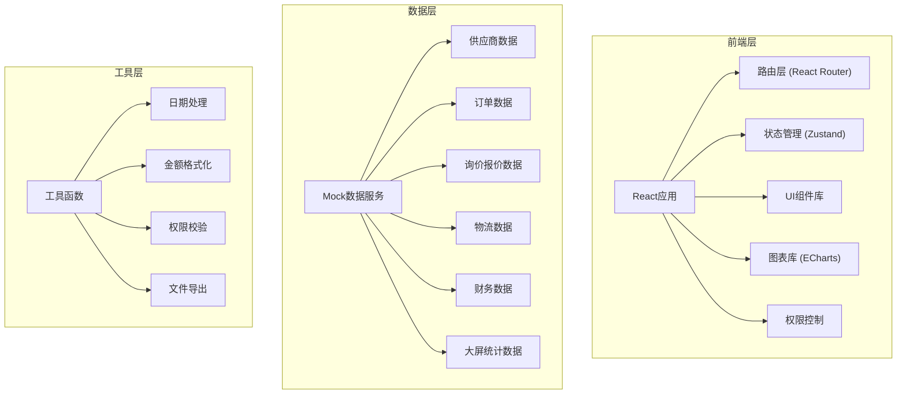
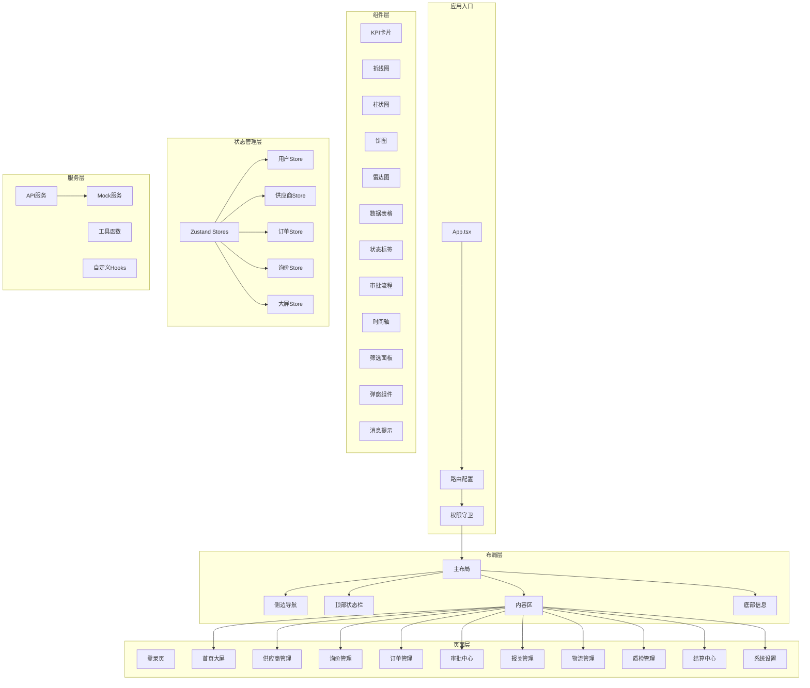
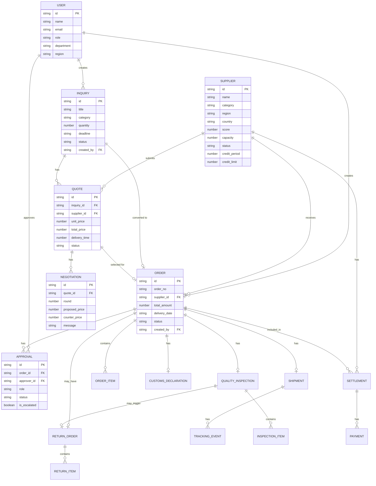

## 1. 架构设计



## 2. 技术描述

- **前端框架**：React@18.2.0 + TypeScript@5.3.0
- **构建工具**：Vite@5.0.0
- **样式方案**：TailwindCSS@3.4.0
- **状态管理**：Zustand@4.4.0
- **路由管理**：React Router@6.20.0
- **UI组件**：Headless UI + Heroicons
- **图表库**：ECharts@5.4.3 + echarts-for-react
- **国际化**：i18next (预留接口，中文为主)
- **数据模拟**：自定义Mock数据层，模拟后端API响应
- **代码规范**：ESLint + Prettier

## 3. 路由定义

| 路由路径 | 页面名称 | 权限角色 | 说明 |
|----------|----------|----------|------|
| /login | 登录页 | 公开 | 角色选择登录 |
| /dashboard | 首页大屏 | 采购员/经理/总监/CEO | 数据概览与分析 |
| /suppliers | 供应商列表 | 采购员/经理/总监/CEO | 供应商管理与推荐 |
| /suppliers/register | 供应商入驻 | 供应商 | 资质信息填写 |
| /inquiries | 询价单列表 | 采购员/经理/总监/CEO/供应商 | 询价单管理 |
| /inquiries/:id | 询价详情 | 采购员/经理/总监/CEO/供应商 | 报价对比与议价 |
| /orders | 订单列表 | 采购员/经理/总监/CEO/供应商 | 采购订单管理 |
| /orders/:id | 订单详情 | 采购员/经理/总监/CEO/供应商 | 订单详情与审批 |
| /approval | 审批中心 | 经理/总监/CEO/财务 | 待办审批处理 |
| /customs | 报关管理 | 采购员/经理/总监/CEO | 报关文件管理 |
| /logistics | 物流计划 | 采购员/经理/总监/CEO/供应商 | 物流跟踪与收货 |
| /quality | 质检管理 | 采购员/经理/总监/CEO/供应商 | 质检与退货处理 |
| /settlement | 结算中心 | 财务/经理/总监/CEO/供应商 | 对账与结算 |
| /settings | 系统设置 | CEO | 用户与权限管理 |

## 4. API 接口定义（模拟）

```typescript
// 用户相关
interface LoginRequest {
  username: string;
  password: string;
  role: 'supplier' | 'buyer' | 'manager' | 'director' | 'ceo';
}

interface LoginResponse {
  token: string;
  user: UserInfo;
}

interface UserInfo {
  id: string;
  name: string;
  email: string;
  role: string;
  department?: string;
  region?: string;
  avatar?: string;
}

// 供应商相关
interface Supplier {
  id: string;
  name: string;
  category: string;
  region: string;
  country: string;
  qualification: string[];
  capacity: number;
  score: number;
  historicalOrders: number;
  totalAmount: number;
  onTimeRate: number;
  qualityRate: number;
  status: 'pending' | 'approved' | 'rejected' | 'suspended';
  creditPeriod: number;
  creditLimit: number;
  createdAt: string;
}

// 询价单相关
interface Inquiry {
  id: string;
  title: string;
  category: string;
  description: string;
  quantity: number;
  specifications: string;
  deadline: string;
  createdBy: string;
  createdAt: string;
  status: 'draft' | 'published' | 'closed';
  quotes: Quote[];
}

interface Quote {
  id: string;
  inquiryId: string;
  supplierId: string;
  supplierName: string;
  unitPrice: number;
  totalPrice: number;
  deliveryTime: number;
  paymentTerms: string;
  warranty: string;
  remarks: string;
  createdAt: string;
  negotiations: Negotiation[];
}

interface Negotiation {
  id: string;
  round: number;
  proposedPrice: number;
  counterPrice: number;
  message: string;
  sender: string;
  createdAt: string;
}

// 订单相关
interface Order {
  id: string;
  orderNo: string;
  inquiryId?: string;
  quoteId?: string;
  supplierId: string;
  supplierName: string;
  items: OrderItem[];
  totalAmount: number;
  currency: string;
  deliveryDate: string;
  shippingAddress: string;
  paymentTerms: string;
  status: 'pending_approval' | 'approved' | 'rejected' | 'in_progress' | 'shipped' | 'delivered' | 'completed' | 'cancelled';
  approvals: Approval[];
  createdAt: string;
  createdBy: string;
}

interface OrderItem {
  id: string;
  productName: string;
  specification: string;
  quantity: number;
  unitPrice: number;
  totalPrice: number;
}

interface Approval {
  id: string;
  orderId: string;
  approverId: string;
  approverName: string;
  role: string;
  status: 'pending' | 'approved' | 'rejected' | 'escalated';
  comments: string;
  createdAt: string;
  approvedAt?: string;
}

// 物流相关
interface CustomsDeclaration {
  id: string;
  orderId: string;
  declarationNo: string;
  goodsDescription: string;
  hsCode: string;
  declaredValue: number;
  currency: string;
  originCountry: string;
  destinationCountry: string;
  status: 'draft' | 'submitted' | 'cleared' | 'pending_tax' | 'completed';
  documents: CustomsDocument[];
  createdAt: string;
}

interface CustomsDocument {
  id: string;
  type: 'invoice' | 'packing_list' | 'bill_of_lading' | 'certificate_of_origin' | 'other';
  name: string;
  url: string;
}

interface Shipment {
  id: string;
  orderId: string;
  trackingNo: string;
  carrier: string;
  shippingMethod: string;
  departurePort: string;
  destinationPort: string;
  estimatedDeparture: string;
  estimatedArrival: string;
  actualDeparture?: string;
  actualArrival?: string;
  status: 'pending' | 'in_transit' | 'arrived' | 'customs_clearance' | 'delivered';
  trackingEvents: TrackingEvent[];
  createdAt: string;
}

interface TrackingEvent {
  id: string;
  status: string;
  location: string;
  timestamp: string;
  description: string;
}

// 质检相关
interface QualityInspection {
  id: string;
  orderId: string;
  shipmentId: string;
  inspectedBy: string;
  inspectionDate: string;
  items: InspectionItem[];
  overallResult: 'passed' | 'failed' | 'partial';
  remarks: string;
  createdAt: string;
}

interface InspectionItem {
  id: string;
  productName: string;
  quantityInspected: number;
  quantityPassed: number;
  quantityFailed: number;
  failureReasons: string[];
  result: 'passed' | 'failed';
}

interface ReturnOrder {
  id: string;
  orderId: string;
  inspectionId: string;
  supplierId: string;
  reason: string;
  items: ReturnItem[];
  status: 'pending_confirmation' | 'confirmed' | 'in_transit' | 'received' | 'completed';
  createdAt: string;
}

interface ReturnItem {
  id: string;
  productName: string;
  quantity: number;
  unitPrice: number;
  totalPrice: number;
}

// 结算相关
interface Settlement {
  id: string;
  settlementNo: string;
  supplierId: string;
  orderIds: string[];
  periodStart: string;
  periodEnd: string;
  totalAmount: number;
  paidAmount: number;
  unpaidAmount: number;
  dueDate: string;
  status: 'pending' | 'confirmed' | 'partial_paid' | 'paid' | 'overdue';
  createdAt: string;
}

interface Payment {
  id: string;
  settlementId: string;
  amount: number;
  paymentDate: string;
  paymentMethod: string;
  referenceNo: string;
  createdAt: string;
}

// 统计数据
interface DashboardStats {
  totalPurchaseAmount: number;
  totalPurchaseAmountYoY: number;
  totalPurchaseAmountMoM: number;
  onTimeDeliveryRate: number;
  onTimeDeliveryRateYoY: number;
  qualityPassRate: number;
  qualityPassRateYoY: number;
  pendingApprovals: number;
  pendingOrders: number;
  activeSuppliers: number;
}

interface TrendData {
  date: string;
  amount: number;
  category: string;
}

interface BuyerEfficiency {
  buyerId: string;
  buyerName: string;
  department: string;
  orderCount: number;
  totalAmount: number;
  avgApprovalTime: number;
  costSaving: number;
}
```

## 5. 前端模块架构



## 6. 数据模型（Mock数据结构）

### 6.1 实体关系图



### 6.2 目录结构

```
src/
├── assets/                 # 静态资源
│   ├── fonts/             # 字体文件
│   ├── images/            # 图片资源
│   └── styles/            # 全局样式
├── components/            # 通用组件
│   ├── charts/            # 图表组件
│   ├── layout/            # 布局组件
│   ├── ui/                # 基础UI组件
│   └── business/          # 业务组件
├── hooks/                 # 自定义Hooks
├── mock/                  # Mock数据
│   ├── data/              # 模拟数据
│   └── services/          # 模拟API服务
├── pages/                 # 页面组件
│   ├── Login/
│   ├── Dashboard/
│   ├── Suppliers/
│   ├── Inquiries/
│   ├── Orders/
│   ├── Approval/
│   ├── Customs/
│   ├── Logistics/
│   ├── Quality/
│   ├── Settlement/
│   └── Settings/
├── router/                # 路由配置
├── store/                 # Zustand状态管理
├── types/                 # TypeScript类型定义
├── utils/                 # 工具函数
├── App.tsx
└── main.tsx
```
